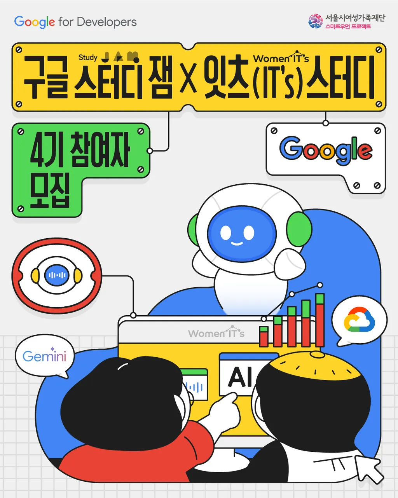
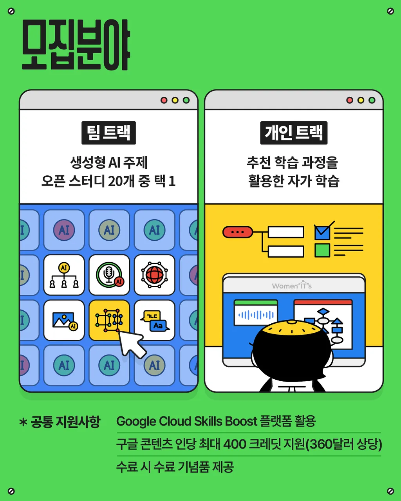
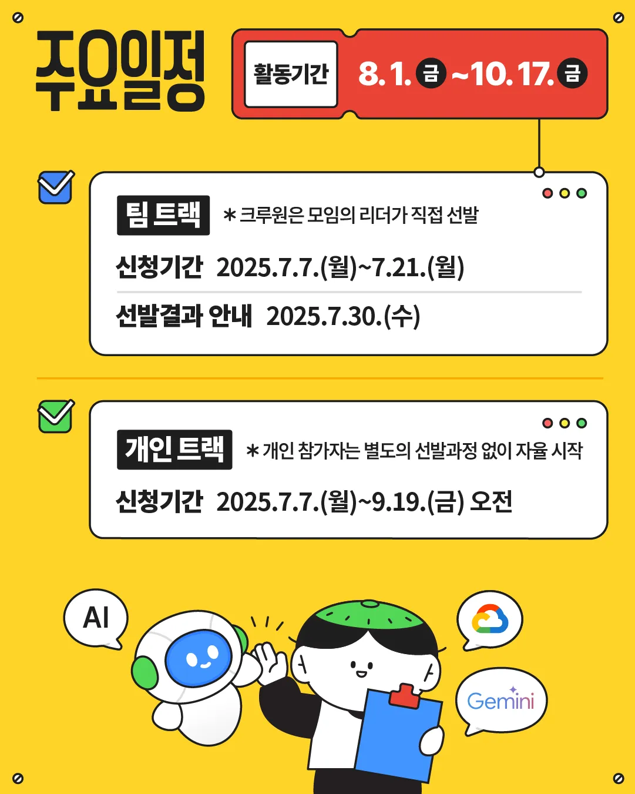

# 🌟 구글 스터디 잼 X 잇츠 스터디 - 개인 트랙

---

<p align="center">
  
  
  
</p>
 

---

## 📂 디렉토리 구조

```plaintext
📁 seoul_women_its_study_4th/
 ┣ 📁 personal_track/          개인 트랙 학습 기록 및 뱃지 인증
 ┃ ┣ 📁 skill_badges/          추천 학습 과정 및 뱃지 실습 기록
 ┃ ┣ 📁 completion_badges/     완료 과정 실습 기록
 ┣ 📁 team_challenges/         팀 트랙 22개 주제 개인 도전 기록
 ┃ ┣ 📁 challenge_01/          [AI] 구글러 Gemini AI 연구소
 ┃ ┗ ...
 ┣ 📁 images/                  포스터 및 시각화 자료
 ┣ 📁 resources/               -
 ┣ 📄 README.md                설명 문서
 ┗ 📄 requirements.txt         사용한 패키지 목록
```

## 🎯 목표 (Goals)

- 구글 스터디 잼의 **AI · Gemini · Google Cloud** 추천 과정을 완주하고 개인 역량 강화
- **Skill Badges 8개 이상 + Completion Badges** 획득 및 프로젝트형 학습 진행
- 팀 트랙 22개 주제를 개인 프로젝트로 재구성하여 포트폴리오로 발전

---

## 📜 Rules

1. 매주 최소 2개의 **Skill Badge** 과정 완료
2. 개인 트랙 전 과정 수료 후 팀 트랙 22개 주제 중 관심 분야부터 도전
3. 진행한 학습은 **마크다운 노트, 코드, 뱃지 캡처 이미지**와 함께 기록
4. 학습 후 반드시 **회고 및 적용 사례 작성**
5. 디렉토리 구조에 맞게 결과물 체계적으로 관리

---

## 🏅 추천 학습 과정 (전체 목록)

### ✅ Skill Badges

| Skill Badges (1)                                          | Skill Badges (2)                                            |
|-----------------------------------------------------------|--------------------------------------------------------------|
| Prompt Design in Vertex AI                                | Build Real World AI Applications with Gemini and Imagen     |
| Cloud Speech API: 3 Ways                                   | Prepare Data for ML APIs on Google Cloud                    |
| Automate Data Capture at Scale with Document AI           | Use Machine Learning APIs on Google Cloud                   |
| Build and Deploy Machine Learning Solutions on Vertex AI  | Build Custom Processors with Document AI                    |
| Develop GenAI Apps with Gemini and Streamlit               | Explore Generative AI with the Vertex AI Gemini API          |
| Inspect Rich Documents with Gemini Multimodality and RAG  | The Basics of Google Cloud Compute                          |
| Secure BigLake Data                                        | Secure Software Delivery                                     |
| Get Started with Sensitive Data Protection                |                                                              |

---

### ✅ Completion Badges

| Completion Badges (1)                                    | Completion Badges (2)                                         |
|-----------------------------------------------------------|----------------------------------------------------------------|
| Achieving Advanced Insights with BigQuery                 | Boost Productivity with Gemini in BigQuery                    |
| Gemini for Data Scientists and Analysts                   | Google Cloud Computing Foundations: Data, ML, and AI          |
| Google Developer Essentials                               | Machine Learning in the Enterprise                            |
| Modernizing Retail and Ecommerce Solutions with Google Cloud | Workspace: Add-ons                                           |
| Intermediate ML: TensorFlow on Google Cloud               | Advanced ML: ML Infrastructure                                |
| Responsible AI for Developers: Privacy & Safety           | Work with Gemini Models in BigQuery                           |

---

### 🚀 팀 트랙 22개 AI 주제 목록

| 팀 트랙 주제 (1)                                         | 팀 트랙 주제 (2)                                              |
|-----------------------------------------------------------|----------------------------------------------------------------|
| [AI] 구글러 Gemini AI 연구소                             | [AI/Gemini] 내공냠냠                                           |
| [생성형 AI + 클라우드 기반 실습] GenAIxGCSB              | [AI/Gemini] GemiNight (Gemini 실습하는 개발자들의 밤)        |
| [백엔드/인프라] 가상 면접 사례로 배우는 대규모 시스템 설계 | [AI] Gemini 기초 및 애플리케이션 개발 적용 스터디            |
| [Gen AI] 생성형 AI의 생애주기 맛보기: Gen AI A-Z         | [AI/GenAI] 육퇴 후 GenAI                                      |
| [AI/Gemini] 알이즈웰(AI is well): 노코드 AI 앱 만들기     | [AI Agent] LLM과 RAG를 활용한 AI Agent 개발 및 배포하기       |
| [AI/기획/개발] 실전! 수익을 낼 수 있는 AI 서비스 직접 개발 | [AI/업무 자동화] 따또가(따로 또 같이)                         |
| [AI, 개발] Gemini Vibe Lab                                | [AI, Gemini] 인홈사 (인공지능 홈페이지 제작 및 사무자동화)    |
| [AI, 기초수학] Beyond Black Box: AI 개발 수학적 기초       | [AI, 클라우드] Gemini × GCP: 생성형 AI 기반 웹서비스 만들기   |
| [AI,개발,디자인] AI × Python: 데이터 시각화 및 게임 개발  | [AI융합×Cloud 실전] AI융합 구글 클라우드 실전 연구회          |
| [데이터분석] 데이터수집부터 대시보드까지! Gemini 활용     | [GenAI] 작은 성취로부터 ✨                                     |
| [Cloud/Web] 지금부터 GCP로 나만의 서비스 운영하기         | [AI, 개발] 생성형 AI 실전 스터디: 개발자를 위한 AI 비서 만들기 |
